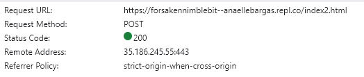
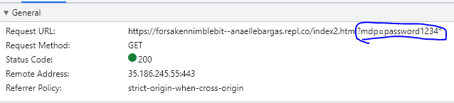

|    |   Informations saisies contenues dans |  Marque-page et historique de navigation |   Cache et fichier log du serveur |   Comportement lors de l’actualisation du navigateur / Bouton « précédent »    | Type de données | Longueur des données |
|---    |:-:    |:-:    |:-:    |:-:   |:-:  |--: |
POST |   corps de la requête  |   url stocké sans les paramètres de l'url   |  les paramètres url ne sont pas enregistrés  |  Les paramètres sont renvoyées à nouveau  |   Caractères ASCII + données binaires  | Illimitée
GET |   url   |   url stocké avec les paramètres de l'url  |  paramètres enregistrés sans chiffrement  |   Les paramètres de l’URL n'ont pas à être envoyés à nouveau. |   Caractères ASCII  | Limitée à la longueur maximale de l'url : 2 048 caractères. |

Source : https://www.ionos.fr/digitalguide/sites-internet/developpement-web/get-vs-post/
